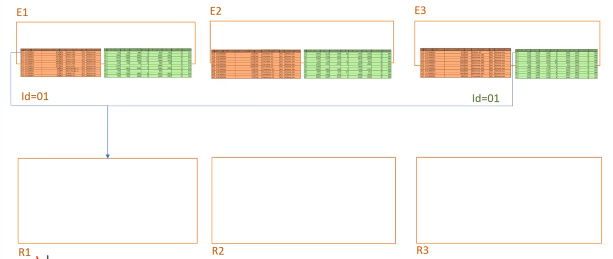

# Decision Support System
Eintscheidungsunterstützungssystme sind Softwaresysteme, die für menschliche Entscheidungsträger für operative und strategische Aufgaben relevante Informationen ermittlen, aufbereiten, übersichtlich zusammenstellen und bei der Auswertung helfne. 


# Expertensystemen
Ein Expertensystem ist ein Computerprogramm, das Menschen bei der Lösung von komplexeren Porblemen wie Experte unterstützen kann, indem es Handlungsempfehlungen aus einer Wissensbasis ableitet. 


# Datawarehouse
* Subjektorientert (getrennt nach Favhbereichen)
* integriert (integriert mit einheitlichem Datenmodell)
* time-variant (Datenzustände zu unterschiedl. Zeitpunkten)
* nonvolatile (dauerhaft gespeichert und nicth mehr geändert)

## Referenzarchitektur 
Eine Referenzarchitektur eines DHW

1) `Staging`\
    Zusammenenfügen unterschiedlicher Datenquellen (exel,sql,xml)
2) `Integration`\
    Fehlerbehebung der im Staging entsandenen Konflikte (Datumsformat, units, Namenskonventionen) und Zusammenführen in ein einheitliches Datenmodell
3) `Enrichment`\
    Zentrale Erzeugung wiederverwendbarer Daten z.b. Kunden, Veträge, Klassifikationen, Berechnete KPIs (Key Performance Indicators)
4) `Analysis`\
   1) Datamarts
       * Datenmodell für die abfrage optimieren. 
       * `Denormalisieren`
       * `Star-Schema`\

    2) Buisness Inteligence
       * Auswertung basierend auf den Datamarts
# Buisness Intelligence 
Verfahreun und Prozesse zuer systematischen analyse (Sammlung, Auswertung und Darstellung) von Daten in elektronischer form. 


## OLTP Online Transaction Processing
* Viele kleine Transkationen (updates) 
* Normalisiertes Datenschema
* Konsistente Zugriffe auf aktuelle Daten

**Beispiele**: Hotelreservierungen, Bankomatabbuchungen, ERP-Systeme

## OLAP Online Analytic Processing
* Grosse Queries mit vielen Joins: **keine Updates**
* Redundanz oin den Daten, um Abfragen zu optimieren
* Periodisches Neuladen (täglich oder monatlich)

**Beispiele**: Management Informationen System von Grossfirmen, Wissenschfaftliche Datenbanekn (CERN, Bioinformatik), Wetterdaten. 

## Sternschema
Ist die Kombination von Fakten und Dimensionen. Mit dem Vorteil das **Abfragegeschwindikteiten** sehr hoch sind da weniger Joins benötitgt werden.
Grund für dafür ist die Denormalisierung der Daten weswegen es Duplikate in verschiedenen Tabellen geben kann. 


* `Faktentabellen:` enthält **Fremdschlüssel** auf Dimensionstabelle
* `Dimensionstabellen:` Gelten als Masterdaten und beinhalten die **Primärschlüssel**


## Galaxien
Es existieren mehrer Faktentablellen und zugehörige Stern- bzw. Schneeflockenschemata und man möchte mehr als ein Fakt abbilden. Diese Fakten haben gemeinsame Dimensionen. 


# Dimensionen
Dimensionen sind die BYs, danach wird qualifiziert/gruppiert und sind in der Regel hierarchisch aufgebaut.\
Ansammlung von Daten, die die Fakten von einer bestimmten Sich aus beschreiben. \
Dimensionen beschreiben den **kontextuellen Hintergrund von Fakten**\
Dimensionen dienen der **KLassifizierung von Fakten** 
Dimensionstabellen werden typischer Weise nicht so gross wie Faktentabellen haben dafür gg.f viele Attribute (Spalten)\


## **Zeitdimension**
Es muss meistens eine Zeitdimension modelliert werden da der Datentyp `DATE` zu wenig explizite Merkmale zur Verfügung stellt, es fehlen etwa: 
```Feiertage, Anzahl Tage/Jahr, Stundenzahl pro Tag, Wochentag, Tagnummer im Jahr, Wochennummer, Firmenkalender, Fiskaljahr....```
Eine Modellierung ermöglicht Drill-Down mit dem Selben Ansatz wie bei anderen Dimensionen. 

## Dimensionen und Hierarchien
### **Dimensionen**

* Dimensionen Enthalten Referenzdaten in Sternschema
* Refernzdaten werden in Hierarchien gruppiert.
* Gruppierungen über mehrer Hierarchieeben gestattet. 

### **Hierarchien**
* Hierasrchien sind Gruppen von Entitäten die in eine Abfolge nach Grad, KLasse etx gebracht werden. z.b. (Organisationsstruckturen, Produktkataloge, Zeit) 

### Parent-Child- (recursive-) Hierarchien  
Typisch für Organisationen oder Produkte. 
z.B. `Elektrogeräte->Küchengeräte->Mixer->Stabmixer.` 

Parent-Child Hierarchien sidn typischwerise Baumstrukturen welche sich gut in Tabellen abbilden lassen in dem ein Datensatz auf seinen Vorgänger verweist.\


### Unbalanciert Hierachien
* `ragged hierarchy` abgereissen
* `skip-level hierarchy` fehlende Ebene


## Logische Modelierung Dimensionen
* 1:1
  * Ehepartner
  
* 1:n
  * Manager - Mitarbeiter
  * 
* n:m
  * Produkt und Teile; ein Zylinder kann mehrfach in einem Motor vorkommen. 
  * 

## SDC slow chaning dimensions

1) `SDC Type 1` 
   * ursprünglichle Attribute werden überschreiben 
   * keine Versionierung "as-is-reporting"\
   
2) `SDC Type 2`
   * Bei Änderungen wird ein neuer Eitnrag in der Dimensionstabelle generiert
   * Volle Versioniertung "as-was-reporting
   * `Monotemporale Historisierung`
     * Gibt an, wann Ereignisse dem Sstem bekannt sind (sys time)
     * **ODER** wann sie in der realen Zeit stattgefunden habne (business time)\
     
   * `Bitemporale Historisierung`
     * Gibt an, wann Ereignisse dem System bekannt sind (sys time)
     * **UND** wann sie in der realen Zeit stattgefunden haben (buisness time)\
     
3) `SDC Type 3`
   * Der neue Wert verdrängt den alten
   * Der ursprüngliche Wert wird in einer speziellen Spalte gespeichert\
   


# **Fakten**
Ansammlung von Einzelmessungen / Kennzahlen, verknüpft mit Kontexdaten (Dimensionen)\
Fakten sind die WHATs alles was wir messen.\
Faktentabellen beschreiben eine atomare Aktion zu einem gegebenen Zeitpunkt **keine Updates** nur inserts.\
Faktentabellen werden typischer Weise sehr gross:

**Beispiel**\
Anzahl der Verkäufe (Fakt)
    * für ein bestimmtes Produkt (Dimension)
    * für eine bestimmte Region (Dimension)
    * für einen bestimmten Zeitraum (Dimension)

Fakten sind `quantifizierbar`
* Umsatz, Gewinn, rentabilität
* Einheiten, Wertebereiche, Berechnungsvorschriften

Fakten sind `aggregierbar`
* `additiv` addition entlang aller Dimensionen möglich (Produktionsdaten, Verkaufszahlen)
* `semi-additiv` Addiotn nur entlang ausgewählter Dimensionen gestattet. (Kontostand, Anzahl der Versicherungsverträge)
* `nicht-additiv` (Durchschnittswerte, Prozentanteile, Extrema)

## Performancsteigerung

1) `Flachstruktur` (flattened strcuture)
2) `Schneeflocke` (snowflake)

Beide Ansätze sind anwendbar bei:
* Festen Hierarchieebenen
* Rekursion (nur bedingt.)
  
### Flachstruktur (Fixierung)
Fixierung der Hierarchien ist der populärste Ansatz bei der Dimensionsbildung. 
    * Die Abfrage bracuht keine rekursiven Elemente mehr zu verwenden.  

Beispiel:\

* Alle ebenen werden in einer Tabelle zusammengefasst. 
* Pro ebene wird ein Attribut eingeführt. 

### Schneeflocke

* Jede Ebene wird in einer seperaten Tabelle gehalten.
* Die Hierarchie ist durch die Struktur fixiert. 

## Modelierungstypen für Fakten


### Transactions
Jeder Datenpunkt/ Änderung wird als kontinuierliche Transaktion in einer Tabelle festgehalten. 

### Periodic Snapshots 
Werden zu bestimmten Zeitpunkten erfasst welche eine `definierte Zeitspanne` repräsentiert da diese meist am Ende der Spanne erstellt werden.
* Pro Police/Konto exisitert eine Faktenzeile (auch wenn keine Transaktionen durgeführt wurden)
* Viele Kennzahlen (Kennzahlen die schwer auf Basis Von Transaktionen zu berechenn wären (verdiente Prämie, Kundenklasse))

Vorteil:
* Kontostandabfragen sind eifnach
  
Nachteil:
* Einzelne Transaktionen nicht direkt ersichtlich
* Wenn es wenig/keine Änderungen gibt, muss trotzdem die Tabelle jede Periode aufgebaut werden (wird gross).

### Accumulating Snapshot
Neuer Record, wenn es Änderungen gibt. 
* Zeitperiode nicht fest definiert. (Startzeit Kontoeröffnung Ende: Gegenwart)
* Jedes konto verfügt über eine oder mehrere Faaktenzeilen (mind 1 Eröffnungszeile , eine Zeile für jedes Ereigniss)
* Updates auf Fakten werdn apliziert (Kollisonsdeckung wird verändert (dieser WERt wird von einer einzigen Zeile angebene.))


# Duplikatserkenneung

**Methoden für duplikatserkennung**:
1) Masken / Wildcards
   * Erkennung von Munstern
2) String-Distanzen
   * Lewenstein
3) Phonetische Suche
   * Ähnlich klingende Namen werden mit ähnlichem Code abgebildet. 

## Jaro-Winkler Distanz
 
**Vorteile**
* Sehr generell einsetzbar
* Funktioniert gut bei "kleinen Tippfehlern"
* Jaro-Winkler ist echtes Ähnlichkeitsmass (0 bis 1)
**Nachteile**
* Funktioniert nru bei kurzen Strings (Jaro-Winkler)

## Phonetische Suche (Soundex)
**Verfahren** 
1) Erster Buchstabe ist Teil des Codes
2) Vokale, Umlate und H, W, Y entfernen
3) Restiche Buchstaben anhand Tabelle umkodieren
4) Max. 3 Kodierungen
  
Beispiel: `B`au`d`i`n`o`t`, `B`ou`d`i`n`o`t`, `B`eau`d`i`n`o`t` -> **B353**\


**Nachteile**
* Stark abhängig vom ersten Buchstaben
* Funktioniert gut für Englisch aber nicht für Deutsch. 

## Phonetische Suche (Kölner Phonetik) 
* Spezielle Anpassung an deutsche Sprache
*  Mächtigere Ersetzungstabelle
*  Auch erster Buchstabe wird kodiert
*  Wort wird vollständig kodiert, dh.h. nicht nur 3 Ziffern
*  
**Verfahren**
1) Buchstabenweise Kodierung von links nach rechts entsprechend der Umwandlungstabelle
2) Entfernen aller mehrfach nebeneinander vorkommenden Ziffern.
3) Entfernen aller Codes '0' ausser am Anfang

Beispiel Tsar = 8807 -> 87 vs Zar = 807 -> 87 (gleich)


**Vorteile**
* Sehr gut für Namensabgleichung geeignet 
* Soundex für Englisch optimiert
* Kölkner Phonetik für Deutsch optimiert

**Nachteile** 
* Sprachabhängig
* Kleine Tippfehler können grosse Änderungen bewirken
* Kein richtiges Ähnlichkeitsverfahren (alles oder nichts)


# Big Data 
Big data is durch die 5Vs definiert:
* `Volume`(big):
  * "Large" amounts of data
* `Velocity`(fast):
  * Streams of data need to be processed fast
* `Variety`(different data sources):
  * Text, images, videos, databases, blogs, social network data
* `Veracity`(quality):
  * Data of different quality
* `Value`:
  * Some data are more valuable than users (customer records vs. product description)

## NoSQL
Traditionelle Datenbanken skalieren **nicht** gut vor allem nicht für Big Data. 
* Gute performance, wenn indexes verwendet werden sonst nicht
* nicht effiz8ient für viele kleine inserts 
* Konsistenz nich tnotwendig für alle problem arten
* Mehr und schnellere hardware ist keine lösung da die datenvolumen exponenziell wachsen. 
* Die mehrheit der daten (eta 80% Firmendaten) ist unstrukturier und nicht geignet für (RDBMS)

`NoSQL` 
* Fokusiert auf horizontale skalierbarkeit (shared nothing architecture)
* Unterstütz nur ein subset von traditionelen RDBMS
* Daten sind als key-value pair gespeichert. 

Geiegnet für grosse Datasets da es schneller verarbeitet werden kann.
Write once read many times compared to RMDBS wirte and read many times

## Map Reduce 
Ermöglicht es parallele und fehler tolerante Datenverarbeitung auf konsumentenhardware. 

* Datan lesen -> `map-phase`
  * Extract data out of each record
  * Map: [key, value] -> list([another key, another value])
  * Every node in cluster processes parts of the data
* `Sort data`
  * Group by keys
* Resultate schreiben -> `reduce-phase`
  * aggregation von daten 
  * Reduce [key, list(value)] -> [key, value]
  * Every node processes parts of the keys. 


# Spark 

## Transformations

* Transformations beschreiben wie wir eine Datenstruktur modifizieren möchten.
* Das Anwenden einer Transformation gibt eine neue Datenstrucktur zurück. Verändert jedoch nicht die Bestehende.
* Wenn wir eine Reihe von Transoformationen anwenden wird spark diese erst ganz am Ende ausführen. Dies ermöglicht es Spark einen sehr efektiven Ausführungsplan zu erstellen. 
Bsp. Transformation:\
```
# myRange contains a colle ction of numbers. 
divBy2 = myRange.where("id % 2 = 0")
divBy6 = divBy2.where("id % 6 = 0")
```
`Hier würde es nur Aktionen auf ID's ausführen welche druch 6 Teilbar sind.`

## Narrow Transformations
Eine `narrow transformation` heist das jede input Parititon nur eine output Parition erzeugt. Beispiele wäre ein `where` filter.\


## Wide Transformation 
Bedeutet das jede input Partition zu mehreren output Partitionen beiträgt.\


## Actions
Actions sind operationen welche etwas anderes ausser RDD, DataFrame or Dataset returnen. Beispiel wäre `count`.\
Es gibt 3 Arten von Actions
* To bring data back to the driver
* To collect data to native objects in the respective programming language
* To write to output data sources

## Iterators 

# Hadoop
Ist ein `Paralleles file system` um grosse mengen daten zui verwalten. Läuft auf Linux file systemen. Dataen sind auf n Maschinen verteilt. 


## HDFS
* Master-slave architecture: 
  * `Master`
    * NameNode that manages the metadata
    * maps blocks (or chunks) of files to DataNodes
    * responsible for failure detection
  * `Slaves` 
    * one or more slave DataNodes store the data
    * process the actaul read and write operations

1) Das file wird in Blöcke von 128MB(konfigurierbar) gesplited
2) NameNode(Master) speichert die metadaten über die location der daten und aktiviert DataNodes
3) DataNode(worker) speichert die datenblöcke. 


### Write


### Read


# Parquet 

## File Storage
Es gibt verschiedene Arten wie wir logische strukturierte Daten(Row/col) physisch speichern können. 
 
Je nach Anwendungsfall `OLTP` oder `OLAP` machen unterschiedliche physische strukturen sin. 

### Row-wise
* Horizontale partitionierung
* 1 zu 1 mapping des logischen zum physischen mapping 
* up
  
**Stärke** gut für `OLTP`. Updates können einfach am ende angehängt werden. 

**Schwäche** schlecht für `OLAP`


### Columnar
* Vertical Paritioning

**Stärke** Gut für `OLAP`, bessere Komprimierbarkeit (runlength encoding)

**Schwäche** schlecht für `OLTP`, wenn wir ein grosses dataset haben das ergänzt/ geänder werden muss ist dies eine sehr intesnsive aufgabe da fast alles neu geschriben werden muss. 


### Hybrid
* Horizontal and Vertical partitioning
* **Used by parquet & ORC**
* Best of both worlds


### Row-wise Vs Collumnar
Wenn wir daten aus col a und b brauche ergibt sich folgendes memory zugriffs pattern. Dies ist ein ungünstiges zugriffspattern 


## Parquet file


## Parquet encoding

### Incremental Encoding 


### Dictionary Encoding 


encoded = faster
sort so medatada can be levered 
also usae typed predicates dont cast
make few files because for every file we need internal data strctures , instantiate reader obj, fetch file, parse parqet metadata
avoide huge files 

## Parquet opitimization techniques

* reduce I/O
  *  reduce size
     *  use page compression, accommodate for RLE_dictionary
  *  avoid reading irrelevant data
     *  row group skipping: min/max & dictionary filtering
     * leverage parquet partitioning
* reduce overhead
  * avoid having many smal files (or few huge ones)
* Delta Lake    
  * (auto-) optimize additional skipping, Z-ORDER
  

# Query Optimization

**Phases of SQL planing**


1) We have a querry  
```
SELECT sum(v)
FROM (
  SELECT 
    t1.id,
    1+2+t1.value AS v
  FROM t1 JOIN t2
  WHERE 
    t1.id = t2.id AND
    t2.id > 50*1000 ) tmp
```
2) We make an `Abstraction Tree` which is the `Locigal Plan`


3) From this we create a `Physical Plan` which defines how to conduct the operations of the `Logical Plan`


## Opitimization of JOINs

### Nested JOIN

**Idea** we only select partial blocks: 


* b(R), b(S) number of blocks in R and S, respectivly 
* *Outer relation*: each block is read only once
* *Inner relation*: read once for each block of outer relation
* Two *inner loops are "free"* (only main memory operations)
* Selektion kann evtl gethreaded werden? 

### Sort-Merge JOIN 

**Idea** we sort both relations on jion attribes beforehand and merge both sorted relations


* We can stop Selecting columns after we reach a certain value and don't need to loop over the whole block. 

### Hash JOIN

**Idea** use the jion attributes as hash keys so each look up is O(log(n))

* *Hash phase*:
  * Scan relation S and compute hash table
* *Merge Phase*: 
  * Iterate over R tuple-wise
  * Join with S by using hash function
* No sorting is required

### Shuflle Hash JOIN
Speciall join of spark to handle joins of huge dataframes that can be split over many servers/Executors in the cluster and thus have no way of knowing where to merge. 



* Each `Executor(E1,E2,E3)` has a part of the dataframe or dataframes.
* The Execturos will send each entry to the corresponding `Reduce Exchange (R1,R2,R3)` . Each Reduce exchange is responsible for a certain keyrange. The key is the `field` of the join condition.\
These Reduce Exchanges are the Map function part.

* Works best when:
  * Distributed evenly with the key you are joining on
  * Have an adequate number of keys for parallelism
    * E.G. if table A has 1M rows but only 20 keys, the aximum parallelism is 20


### Broadcast Hash JOIN

* Can be performed when one `DataFrame` is small enough to fit into main memory:
  * Broadcast "small" DataFrame to all the nodes
* Enables partial local join:
  * No shuffling required
  * No additional communication overhead over network 


* Broadcast Hash Join often better than Shuffle Hash Join (no data transfer over network)
* Should in princibple be automatic but might require hints:
  * Spark SQL on parquet does this automatically
  * **Not if input file is a text file**

### JOIN optimization conclusion
* `Hash JION` is typically faster than sort-merge JOIN (as no sorting is required)
* `Sort-merge JOIN` is typically faster than nested-loop for larger tables
* BUT:
  * `Sort-merge` can be faster than hash join, if both tables are already sorted
  * If the join condition is an `ineqality operator` (<,>,<>) `hash JOIN can't` be used
* Depending on the characteristics of the table (size, data distribution, indexes etc. ) the optimizer chooses the best join strategy. 

## Catalyst Optimizer Strategies
* Goal: Minimize end-to-end query response time

* Two **key ideas**:
  * `Prune` unnecessary data as early as possible
    * E.g filter pushdown, column pruning
  * `Minimize` per-operator cost
    * E.G. broadcast vs.shuffle, optimal join order

## Declarative APIs

* Vague, general definition on declarative Programming. 
* No assumptions or indications on how to fulfil the query.
* Expression order does not necessarily govern execution order (seeQuery plan above)
  
## DataFame

* `DataFrame` consists of:
  * Execution plan
  * Result type schema
  * Underlying `RDD`
* An `RDD` is a **Resilient Distributed Dataset** with:
    * Lineage - how was the input data calcuilated
    * Partition Information - where is the input data actually distributed
    * Instructions - code to be exectued
* What is a  `DataFrame` **NOT**
  * Data


# Machine Learning


